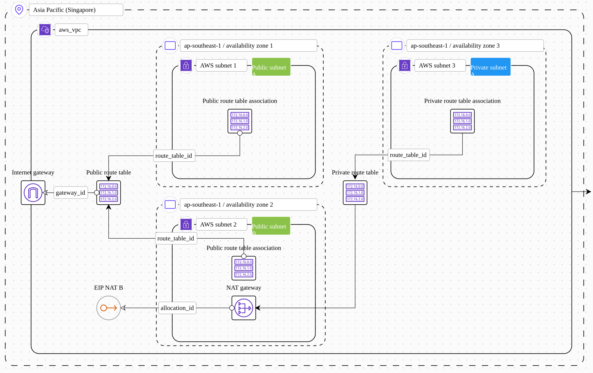
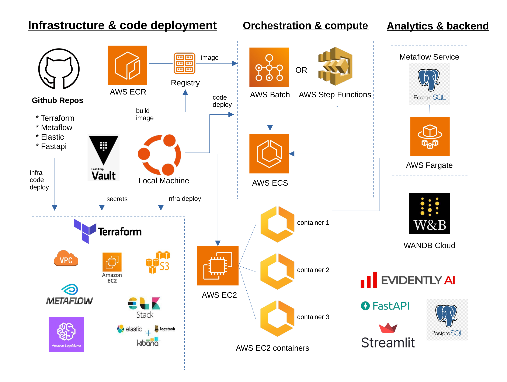

# Complete Metaflow Terraform Example


## VPC and subnets



## Project structure



## Outerbounds original README for Metaflow on AWS deployment
This directory contains a set of Terraform configuration files for deploying a complete, end-to-end set of resources for running Metaflow on AWS using Terraform modules from [terraform-aws-metaflow](https://github.com/outerbounds/terraform-aws-metaflow). 

This repo only contains configuration for non-Metaflow-specific resources, such as AWS VPC infra and Sagemaker notebook instance; Metaflow-specific parts are provided by reusable modules from [terraform-aws-metaflow](https://github.com/outerbounds/terraform-aws-metaflow).

Note: The reusable terraform module (source code [here](https://github.com/outerbounds/terraform-aws-metaflow)) itself includes a couple of full "start-from-scratch" examples of:
* a [minimal Metaflow stack](https://github.com/outerbounds/terraform-aws-metaflow/tree/master/examples/minimal) (using AWS Batch for compute and AWS Step Functions for orchestration)
* a [Kubernetes based Metaflow stack](https://github.com/outerbounds/terraform-aws-metaflow/tree/master/examples/eks) (using AWS EKS for compute, and Argo Workflows for orchestration)


## Pre-requisites

### Terraform

[Download](https://www.terraform.io/downloads.html) and install terraform 0.14.x or later.

### AWS

AWS credentials should be [configured](https://docs.aws.amazon.com/cli/latest/userguide/cli-configure-quickstart.html) in your environment.

#### Note on AWS set of admin permissions required (it is best to break them into groups and mkae admin's account a member of each one - otherwise there are too many of them to add to a single user or group):
	
* AmazonDynamoDBFullAccess - AWS managed - Provides full access to Amazon DynamoDB via the AWS Management Console.
	
* AmazonElasticFileSystemFullAccess - AWS managed - Provides full access to Amazon EFS via the AWS Management Console.
	
* AWSStepFunctionsFullAccess - AWS managed - An access policy for providing a user/role/etc access to the AWS StepFunctions API. For full access, in addition to this policy, a user MUST have iam:PassRole permission on at least one IAM role that can be assumed by the service.
	
* AmazonECS_FullAccess - AWS managed - Provides administrative access to Amazon ECS resources and enables ECS features through access to other AWS service resources, including VPCs, Auto Scaling groups, and CloudFormation stacks.
	
* IAMFullAccess - AWS managed - Provides full access to IAM via the AWS Management Console.
	
* AmazonS3FullAccess - AWS managed - Provides full access to all buckets via the AWS Management Console.
	
* AmazonSESFullAccess - AWS managed - Provides full access to Amazon SES via the AWS Management Console.
	
* AmazonSNSFullAccess - AWS managed - Provides full access to Amazon SNS via the AWS Management Console.
	
* AmazonMachineLearningFullAccess - AWS managed - Provides full access to Amazon Machine Learning resources (if planning to use sagemaker).
	
* AWSCodeDeployFullAccess - AWS managed - Provides full access to CodeDeploy resources (for CI/CD).
	
* AWSCertificateManagerFullAccess - AWS managed - Provides full access to AWS Certificate Manager (ACM)
	
* SecretsManagerReadWrite - AWS managed - Provides read/write access to AWS Secrets Manager via the AWS Management Console. Note: this exludes IAM actions, so combine with IAMFullAccess if rotation configuration is required.

* AmazonEKSClusterPolicy - AWS managed	
This policy provides Kubernetes the permissions it requires to manage resources on your behalf. Kubernetes requires Ec2:CreateTags permissions to place identifying information on EC2 resources including but not limited to Instances, Security Groups, and Elastic Network Interfaces.
(for deploying metaflow to Kubernetes instead of AWS batch)

* CloudWatchFullAccess - AWS managed - Provides full access to CloudWatch (this is for logs).
	
* AmazonEC2FullAccess - AWS managed - Provides full access to Amazon EC2 via the AWS Management Console.
	
* AWSKeyManagementServicePowerUser - AWS managed - Provides access to AWS Key Management Service (KMS).
	
* AmazonAPIGatewayAdministrator - AWS managed - Provides full access to create/edit/delete APIs in Amazon API Gateway via the AWS Management Console.
	
* AmazonEC2ContainerRegistryFullAccess - AWS managed - Provides administrative access to Amazon ECR resources
	
* AWSBatchFullAccess - AWS managed - Provides full access for AWS Batch resources.
	
* AmazonSageMakerFullAccess - AWS managed - Provides full access to Amazon SageMaker via the AWS Management Console and SDK. Also provides select access to related services (e.g., S3, ECR, CloudWatch Logs).

* EC2InstanceProfileForImageBuilderECRContainerBuilds - AWS managed - EC2 Instance profile for building container images with EC2 Image Builder. This policy grants the user broad permissions to upload ECR images.
	
* AmazonEMRFullAccessPolicy_v2 - AWS managed - Provides full access to Amazon EMR
(this is only needed to use Spark cluster - not included in this repo, although private subnet is created for it)

* AmazonEventBridgeFullAccess - AWS managed - Provides full access to Amazon EventBridge (needed for AWS Step Functions).

internally generated metaflow roles would need to be modified directly in the AWS IAM console - to add arn of the kms key for example (as they are set to run on a project bucket, but not on any extra ones used throughout the project)

### AWS account whose credentials are passed in the ENV variables should have permissions required by the python code logic only (namely s3) as everything else is run under specific roles generated by Terraform


## Setup

### Infrastructure stack

The infra sub-project provides example networking infrastructure for the Metaflow service. For more details see the [README](infra/README.md)

Copy `example.tfvars` to `prod.tfvars` (or whatever environment name you prefer) and update `env` name and the `region` as needed. These variables are used to construct unique names for infrastructure resources. Best to search and replace env and region in the entire project as some modules are initialized without prod.tfvars.
ENV variable is used for naming metaflow main bucket where all artifacts are stored - pick a value which in combination with the region results in a unique bucket name.

To deploy, initialize Terraform:

```bash
cd infra && terraform init
```

Apply the configuration:

```bash
terraform apply --var-file prod.tfvars
terraform destroy --var-file prod.tfvars
```

### Metaflow stack

The metaflow sub-project uses modules from [terraform-aws-metaflow](https://github.com/outerbounds/terraform-aws-metaflow) to provision the Metaflow service, AWS Step Functions, and AWS Batch resources. 

Copy `example.tfvars` to `prod.tfvars` (or whatever environment name you prefer) and update that `env` name and the `region` as needed. These variables are used to construct unique names for infrastructure resources.

#### Securing the Metadata API (optional)

By default, the Metadata API has basic authentication enabled, but it is exposed to the public internet via Amazon API Gateway. To further restrict access to the API, the `access_list_cidr_blocks` can be set to specify IPs or network cidr blocks that are allowed to access the endpoint, blocking all other access.

Additionally, the `enable_step_functions` flag can be set to false to not provision the AWS Step Functions infrastructure.

To deploy, initialize Terraform:

```bash
cd metaflow && terraform init
```

Apply the configuration:

```
terraform apply --var-file prod.tfvars
terraform destroy --var-file prod.tfvars
```

Once the Terraform executes, configure Metaflow using `metaflow configure import ./metaflow_config_<env>_<region>.json`
Then edit config.json:
sudo nano ~/.metaflowconfig/config.json
There will be an aws cli command to fetch the api key
run it, copy api key to config.json and save it

### Using a custom container image for AWS Batch (@conda_base decorator requires conda to be used as a dependency manager, which is frustrating at best, using ECR image with pip is more straightforward)

A custom container image can be used by setting the variable `enable_custom_batch_container_registry` to `true`. This will provision an Amazon ECR registry, and the generated Metaflow configuration will have `METAFLOW_BATCH_CONTAINER_IMAGE` and `METAFLOW_BATCH_CONTAINER_REGISTRY` set to point to the private Amazon ECR repository. The container image must then be pushed into the repository before the first flow can be executed.

### add to .bashrc (or paste in the VS code every time to debug scripts locally - on AWS batch and AWS Step Functions these credentials are passed from Vault by Terrafowm)
``` 
* export OPENAI_API_KEY=your openai_api_key
* export HUGGINFACE_TOKEN=hugginface_token
* export USDA_API_KEY=USDA_API_KEY #(only needed for extras)
* export WANDB_API_KEY=WANDB_API_KEY #(create free wandb.ai account to use wandb)
* export AWS_ACCESS_KEY_ID=your_aws_access_key_id (aws account to use boto3 - so s3 and Step Functions permissions are needed at minimum)
* export AWS_SECRET_ACCESS_KEY=your_aws_secret_access_key
* export AWS_REGION=your_aws_region
* export ECR_REPO_NAME=your_ecr_repository_name
* *export ECR_REPO_URI=$(aws ecr describe-repositories --repository-names $ECR_REPO_NAME --query 'repositories[0].repositoryUri' --output text --region $AWS_REGION)
additional (optional)
* export ES_PASSWORD=elastic_search_password #(set in EC2 module)
* export ES_LOCAL_HOST=elastic_search_ec2_public_ip
* export MONITORING_DB_HOST="0.0.0.0" #(default)
* export POSTGRES_USER=postgres_username_set_in_evidently_block
* export POSTGRES_PASSWORD=postgres_password_set_in_evidently_block 
```

### AWS Cli command to create ECR repo (just in case metaflow-created one doesn't suit)
```aws ecr create-repository --repository-name your_ecr_repository_name --region your_aws_region```

batch module builds and pushes docker image to ECR on terraform apply - no addiitonal steps needed

These are manual commands - might be useful for debugging - not needed for the project

    ## create compute environment
    ```aws batch create-compute-environment \
        --compute-environment-name metaflow-env \
        --type EC2 \
        --state ENABLED \
        --compute-resources minvCpus=1,maxvCpus=4,instanceTypes=m5.large,subnets=subnet-abc123 \
        --service-role arn:aws:iam::0123456789012:role/awsbatchservicerole \
        --region us-west-2```

    ## create batch job definition
    ```aws batch register-job-definition --job-definition-name project-script-name \
    --type container \
    --container-properties '{
        "image": "388062344663.dkr.ecr.ap-southeast-1.amazonaws.com/metaflow:latest",
        "vcpus": 2,
        "memory": 4000,
        "command": ["python", "flow_script_to_run.py"m, "arg1", "arg2" ]
    }'```

    ## to creat a queue
    ```aws batch create-job-queue --job-queue-name sparkhudi-queue --priority <QUEUE_PRIORITY> --compute-environment-order order=1,     computeEnvironment=<COMPUTE_ENVIRONMENT_ARN> ```

    <QUEUE_PRIORITY>: The priority value for your job queue. Valid values range from -1024 to 1024, where -1024 is the lowest priority and 1024 is the highest.
    <COMPUTE_ENVIRONMENT_ARN>: The ARN of the compute environment you want to associate with your job queue.

    ## to submit a job:
    ```aws batch submit-job --job-name job-name \
    --job-definition project-script-name \
    --job-queue <your-job-queue-name> ```

### Batch (best to run after ELK stack has been deployed so that ES_LOCAL_HOST and ES_PASSWORD can be set in the vault)
``` 
cd batch && terraform init
terraform apply
```

### Amazon Sagemaker Notebook Infrastructure (optional)

The sagemaker-notebook subproject provisions an optional Jupyter notebook with access to the Metaflow API.

Copy `example.tfvars` to `prod.tfvars` (or whatever environment name you prefer) and update that `env` name and the `region` as needed. These variables are used to construct unique names for infrastructure resources.

To deploy, initialize Terraform:

`cd sagemaker && terraform init`

Apply the configuration:

```
terraform apply --var-file prod.tfvars
```

The Amazon Sagemaker notebook url is output as `SAGEMAKER_NOTEBOOK_URL`. Open it to access the notebook.

### ELK 

To deploy, initialize Terraform:

`cd ec2 && terraform init`

Change .env file to your own values before deploying

Apply the configuration:

```
terraform apply
```
kibana should be available on remote_ip:5601
elastic search should be available on remote_ip:9200

for more detailed instructions follow README.md under ec2 folder

### metaflow flows can be run from the local machine or from the remote (all necessary env vars and config files are already in place)
this might be needed to keep ELK accessable only within vpc - flows can access "localhost:9200"

to run on the local make sure the following variables are set
```
* export OPENAI_API_KEY="XXXXXXXXXXXXXXXXXX" #### (only needed for testing new scoring model in extras)
* export HUGGING_FACE_TOKEN="xxxxxxxxxxxxxxxxxxxxxxxxxxxx" #### (required for embeddings calculations - can be obtained from huggingface.co for free)
### this api key is needed to fetch additional data from USDA (again - under extras: sf_usda_to_es_flows.py - takes very long time to run due to the usda api hit limits)
* export USDA_API_KEY="xxxxxxxxxxxxxxxxxxxxxxxxxx"
```

### if using elastic cloud ec2 modules doesn't need to be applied, but all the additional variables need to be set
```
* export ES_CLOUD_ID="xxxxxxxxxxxxxxxxxxxxxx"
* export ES_USERNAME="xxxxxxxxxxxxxxxxx"
* export ES_PASSWORD="xxxxxxxxxxxxxxxxxxx"
* export ES_ENDPOINT="xxxxxxxxxxxxxxxxxxxxxxxxxxx"
* export ES_CLOUD_HOST="xxxxxxxxxxxxxxxxxxxxxxx"

* export ES_USERNAME="xxxxxxxxxxxxxxxxx"
* export ES_LOCAL_HOST="remote_machine_public_ip"
```

### under mlops-infra root dir open new terminal window to git clone metaflow python flows
```
git clone https://github.com/arybach/mlops-metaflow.git
cd mlops-metaflow
```
> check:
[0] % metaflow status
Metaflow (2.9.4)

Using Metadata provider at: "https://ezhax7qv0f.execute-api.ap-southeast-1.amazonaws.com/api/"

To list available flows, type:

1. python
2. from metaflow import Metaflow
3. list(Metaflow()) 

if Metadata provider is local - not from aws address - check steps in README.md under metaflow dir (most likely config was not set properly)
```
cd mlops-metaflow
python3 -m venv .venv
source .venv/bin/activate
pip install -r requirements.txt
```

check contents of the metaflow config file: 
```
~/.metaflowconfig/config.json
```

this line will contain instructions on how to fetch auth_key:
"METAFLOW_SERVICE_AUTH_KEY": "## Replace with output from 'aws apigateway get-api-key --api-key xxxxxx --include-value | grep value' ##",

place output of the command into config file "METAFLOW_SERVICE_AUTH_KEY": "xxxxxxxxxxxxxx" 

detailed instructions are in README.md under mlops-metaflow dir

### Hint: use aws cli to set proper region name - should not contain any quotes
```
aws configure get region
aws configure set region ap-southeast-1
```

### Evidently
```
cd fastapi
terraform init
terraform apply
```
this will spin up an EC2 instance, git clone https://github.com/arybach/mlops-evidently.git repo (README.md with more details is available there), launch docker-comose with fastapi and streamlit app from Evidently own examples (modified for this project), run tests and deploy xgboost_model and linear_regression_model from aws s3 bucket mlops-nutrients
It exposes public ips 5001 and 8501 for fastapi and streamlit respectively. Public eip should be either removed or CIDR set to ips of the users who need access to the app. Flows are able to communicate with fastapi via private ip except for those executed during debugging on a local machine (i.e. outside of the vpc)

### Further improvements
* replace single-node elasticsearch with a cluster or use an enterprise cloud version for fast vector embeddings on ingestion
* implement proper fastapi for model deployment
* switch to Metaflow on EKS for better scalability, orchestration with Argo Workflows and faster startup timesv in q4 Metaflow will add more scheduling features for orchestration of the flows (alternatively metaflow flows can be deployed to Airflow)